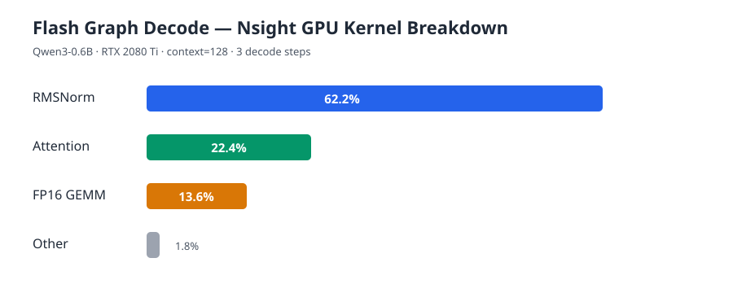

# CUDA LLM Inference Runtime

一个面向 decoder-only LLM 的 CUDA/C++ 推理 Runtime，当前以 Qwen3-0.6B 为适配模型，同时将模型执行拆分为通用 decoder runtime 与 Qwen3 adapter。

## 主要能力

- CUDA FP16 推理：embedding、Linear、RMSNorm、RoPE、SwiGLU、GQA。
- Paged KV cache：支持 B=1、batch paged decode、variable-length decode 和 device-side KV 写入。
- FlashAttention-style 路径：packed prefill、B=1 paged decode、batch paged decode、variable-length attention，使用 online softmax。
- CUDA Graph decode：支持固定 B=1，以及固定 B=2/B=4 的 reference/Flash Graph replay。
- 持久化 decode workspace、cuBLASLt workspace/algorithm cache 和 graph cache，steady-state 避免动态显存分配。
- 多步 eager/reference Graph/Flash Graph token 一致性、block boundary、cache full 和 rollback 测试。

## Benchmark

测试环境：NVIDIA GeForce RTX 2080 Ti，compute capability 7.5，Qwen3-0.6B，FP16 KV cache。以下是 decode 阶段平均单步延迟和吞吐；吞吐按 batch size 统计。

### B=1，10 decode steps

| Context | Eager | Reference Graph | Flash Graph |
|---:|---:|---:|---:|
| 15 | 58.95 ms / 16.96 tok/s | 58.40 ms / 17.12 tok/s | 57.82 ms / 17.29 tok/s |
| 32 | 60.47 ms / 16.54 tok/s | 61.43 ms / 16.28 tok/s | 57.90 ms / 17.27 tok/s |
| 128 | 70.85 ms / 14.11 tok/s | 70.90 ms / 14.10 tok/s | 59.60 ms / 16.78 tok/s |

context=128 时，Flash Graph 相比 Eager 延迟降低约 15.9%，吞吐提升约 18.9%。

### Batch decode，3 decode steps

| Batch | Context | Eager | Reference Graph | Flash Graph |
|---:|---:|---:|---:|---:|
| 2 | 15 | 66.46 ms / 30.10 tok/s | 63.66 / 31.42 | 63.04 / 31.73 |
| 2 | 32 | 65.90 / 30.35 | 66.24 / 30.19 | 62.64 / 31.93 |
| 2 | 128 | 72.91 / 27.43 | 73.16 / 27.34 | 67.34 / 29.70 |
| 4 | 15 | 83.10 ms / 48.13 tok/s | 81.04 / 49.36 | 85.17 / 46.96 |
| 4 | 32 | 86.46 / 46.26 | 84.87 / 47.13 | 82.57 / 48.44 |
| 4 | 128 | 95.45 / 41.91 | 93.26 / 42.89 | 84.59 / 47.29 |

10-step context=15 测试中，B=2 Flash Graph 达到 31.94 tok/s，B=4 Flash Graph 达到 47.69 tok/s；两条 Graph 路径均保持 steady-state `cudaMalloc=0/cudaFree=0`。

显存与 kernel launch 统计口径：eager batch decode 每步产生一个 logits 输出分配，B=2 约 0.61 MB、B=4 约 1.22 MB；Graph replay 阶段为 0 次 malloc/free。batch attention wrapper 在 eager 路径每步 dispatch 28 次；Graph 将 28 个 attention kernel 固化为 graph nodes，每次 replay 直接执行这些 nodes。

### Nsight profiling 与算子优化

Nsight Systems 采样显示，Flash Graph decode 的 GPU kernel 时间主要集中在 RMSNorm（约 62.2%），其次是 paged/packed attention（约 22.4%）和 FP16 GEMM。针对 RMSNorm，已将输出归一化阶段改为一个 block 对应一行、128 threads 并行写回；为保持现有 bit-exact KV 回归，平方和仍使用原有 FP64 顺序归约。该优化保持算子误差在原有容差内，并在 RTX 2080 Ti 上将 context=128 的 B=1 Flash Graph 实测延迟从约 59.6 ms 降至约 58.1 ms；后续若允许非 bit-exact fast-math，可进一步启用并行 reduction。



```bash
nsys profile --trace=cuda --sample=none --cpuctxsw=none \
  -o /tmp/cuda_llm_graph \
  ./build/benchmark_paged_decode_e2e MODEL 3 128 graph_flash
```

### 运行 benchmark

```bash
cmake -S . -B build
cmake --build build -j4

./build/benchmark_paged_decode_e2e MODEL 10 128 graph
./build/benchmark_paged_decode_e2e MODEL 10 128 graph_flash
./build/benchmark_paged_decode_e2e MODEL 10 128 batch_eager 4
./build/benchmark_paged_decode_e2e MODEL 10 128 batch_graph 4
./build/benchmark_paged_decode_e2e MODEL 10 128 batch_graph_flash 4
./build/benchmark_paged_decode_e2e MODEL 3 15 batch_compare 4
```

`batch_compare` 使用 mixed-length cache，逐步比较 eager、reference Graph 和 Flash Graph 的 argmax token。

### 自动化 benchmark CSV

脚本会自动运行四组 benchmark suite，覆盖 B=1/2/4、不同 context 和 decode steps，并运行 eager、reference Graph 和 Flash Graph，输出 `benchmark_decode.csv`。CSV 包含 suite、平均延迟、tokens/s、malloc/free 次数、分配字节数和 attention launch 数。

| Suite | Context | Steps | 用途 |
|---|---|---:|---|
| `quick_regression` | 15, 128 | 3 | 快速回归与 block boundary |
| `performance_report` | 15, 32, 128, 256 | 10 | 性能报告 |
| `stability` | 128, 256 | 64 | 长时间 Graph replay |
| `capacity_boundary` | 511 | 1 | cache 容量边界 |

```bash
./tools/run_decode_benchmarks.sh \
  artifacts/phase15/qwen3-0.6b-f32 10 benchmark_decode.csv
```

其中 Graph 的 `attention_launches` 按每次 replay 固化的 28 个 decoder-layer attention nodes 统计；底层 host wrapper counter 在 replay 时不会再次递增。
`capacity_boundary` 没有可用的 warmup token，因此 Graph 会在被测调用中完成 capture；该 suite 的 allocation 反映 capture-time 行为，不应与 steady-state replay allocation 混淆。

## 简历描述

可以写成：

> 设计并实现通用 Decoder-only LLM CUDA 推理 Runtime（C++/CUDA），完成 FP16 fused decoder operators、Paged KV Cache、GQA/FlashAttention-style online softmax 及 Qwen3 adapter；通过 device-side KV/cache metadata、cuBLASLt workspace 持久化和 CUDA Graph replay 消除 decode steady-state 动态显存分配。

> 实现固定 B=1/2/4 的 Paged Decode CUDA Graph，并对 eager、reference Graph、Flash Graph 进行多 context、多步数 benchmark；在 RTX 2080 Ti 上 context=128、B=1 时 Flash Graph 相比 eager 延迟降低约 15.9%、吞吐提升约 18.9%，B=4 Flash Graph 达到约 47.3 tok/s。

> 构建 mixed-length batch decode 数值验证与 rollback 测试，覆盖 block boundary、cache 满容量、pool exhaustion 和多步 token 一致性；Graph replay 阶段保持 `cudaMalloc/cudaFree=0`。
